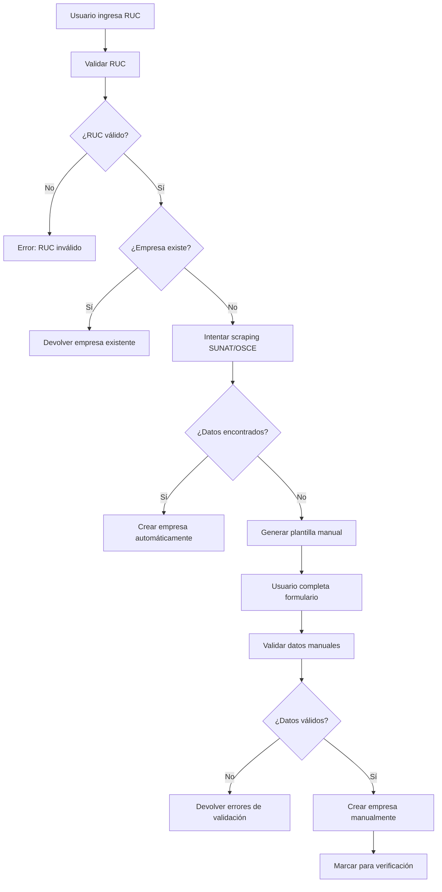

# 🚀 Sistema de Entrada Manual Inteligente para Empresas

## 📋 Descripción General

Este sistema permite la **creación robusta de empresas** combinando **scraping automático** con **entrada manual completa** cuando falla la extracción automática de datos. Incluye validaciones avanzadas, fallback inteligente y un flujo de trabajo optimizado.

## 🏗️ Arquitectura del Sistema

### Componentes Principales

1. **`empresas_smart.py`** - API endpoints inteligentes
2. **`empresa.py` (modelos)** - Modelos mejorados con validaciones
3. **`migration_entrada_manual.sql`** - Migración de base de datos
4. **`test_entrada_manual.py`** - Script de pruebas completas

### Flujo de Trabajo


```mermaid
graph TD
    A[Usuario ingresa RUC] --> B[Validar RUC]
    B --> C{¿RUC válido?}
    C -->|No| D[Error: RUC inválido]
    C -->|Sí| E{¿Empresa existe?}
    E -->|Sí| F[Devolver empresa existente]
    E -->|No| G[Intentar scraping SUNAT/OSCE]
    G --> H{¿Datos encontrados?}
    H -->|Sí| I[Crear empresa automáticamente]
    H -->|No| J[Generar plantilla manual]
    J --> K[Usuario completa formulario]
    K --> L[Validar datos manuales]
    L --> M{¿Datos válidos?}
    M -->|No| N[Devolver errores de validación]
    M -->|Sí| O[Crear empresa manualmente]
    O --> P[Marcar para verificación]
```

## 🛠️ Endpoints Disponibles

### 1. **POST** `/api/empresas/smart/validar-ruc`
Valida RUC e intenta obtener datos automáticamente.

**Request:**
```json
{
    "ruc": "20100070970"
}
```

**Response exitosa (datos encontrados):**
```json
{
    "ruc": "20100070970",
    "valido": true,
    "existe": false,
    "datos_automaticos": {
        "razon_social": "EMPRESA EJEMPLO S.A.C.",
        "direccion": "AV. EJEMPLO 123",
        "estado": "ACTIVO",
        "representantes": [...],
        "fuente_datos": ["SUNAT", "OSCE"],
        "calidad_datos": "BUENA"
    },
    "requiere_entrada_manual": false,
    "mensaje": "Datos encontrados automáticamente",
    "timestamp": "2024-01-27T10:30:00"
}
```

**Response (requiere entrada manual):**
```json
{
    "ruc": "20123456789",
    "valido": true,
    "existe": false,
    "datos_automaticos": null,
    "errores_scraping": ["Error SUNAT: timeout", "Error OSCE: not found"],
    "requiere_entrada_manual": true,
    "mensaje": "No se pudieron obtener datos automáticamente",
    "timestamp": "2024-01-27T10:30:00"
}
```

### 2. **POST** `/api/empresas/smart/crear-automatica`
Crea empresa usando datos obtenidos por scraping.

### 3. **POST** `/api/empresas/smart/crear-manual`
Crea empresa con entrada manual completa y validaciones.

**Request ejemplo:**
```json
{
    "ruc": "20123456789",
    "razon_social": "MI EMPRESA MANUAL S.A.C.",
    "tipo_empresa": "SAC",
    "estado": "ACTIVO",
    "contacto": {
        "email": "contacto@miempresa.com",
        "telefono": "01-1234567",
        "celular": "999123456",
        "direccion": "Av. Ejemplo 123, Lima"
    },
    "representantes": [
        {
            "nombre": "Juan Pérez García",
            "cargo": "GERENTE GENERAL",
            "tipo_documento": "DNI",
            "numero_documento": "12345678",
            "es_principal": true
        }
    ],
    "categoria_contratista": "EJECUTORA",
    "especialidades": ["EDIFICACIONES", "CARRETERAS"],
    "observaciones": "Empresa creada manualmente",
    "requiere_verificacion": true
}
```

### 4. **GET** `/api/empresas/smart/plantilla-manual/{ruc}`
Genera plantilla para entrada manual (con datos parciales si están disponibles).

### 5. **GET** `/api/empresas/smart/validadores/referencia`
Devuelve listas de valores válidos para formularios.

### 6. **GET** `/api/empresas/smart/estadisticas/entrada-manual`
Estadísticas de empresas creadas manual vs automáticamente.

## ✅ Validaciones Implementadas

### Validaciones de RUC
- ✅ Exactamente 11 dígitos numéricos
- ✅ Debe comenzar con 10 o 20
- ✅ Verificación de existencia en BD

### Validaciones de Representantes
- ✅ Nombre: Solo letras, espacios y caracteres válidos
- ✅ DNI: Exactamente 8 dígitos numéricos
- ✅ CE: Entre 9 y 12 caracteres
- ✅ Solo un representante principal
- ✅ Documentos únicos (sin duplicados)

### Validaciones de Contacto
- ✅ Email: Formato válido con regex
- ✅ Teléfonos: Entre 7 y 15 dígitos
- ✅ URL: Formato válido para página web

### Validaciones de Empresa
- ✅ Razón social: Mínimo 3 caracteres
- ✅ Tipo empresa: Valores predefinidos (SAC, SA, SRL, etc.)
- ✅ Estado: ACTIVO, INACTIVO, SUSPENDIDO
- ✅ Fecha constitución: No futura, no antes de 1900

## 🗄️ Cambios en Base de Datos

### Nuevos Campos en `empresas`
```sql
-- Metadatos de entrada
fuente_datos VARCHAR(20) DEFAULT 'SCRAPING' -- MANUAL, SCRAPING, MIXTO
fuentes_consultadas JSONB -- ["SUNAT", "OSCE", "MANUAL"]
requiere_verificacion BOOLEAN DEFAULT FALSE
calidad_datos VARCHAR(20) DEFAULT 'BUENA' -- BUENA, ACEPTABLE, PARCIAL

-- Campos adicionales
pagina_web VARCHAR(255)
redes_sociales JSONB -- {"facebook": "url", "linkedin": "url"}
sector_economico VARCHAR(100)
tamaño_empresa VARCHAR(20) -- MICRO, PEQUEÑA, MEDIANA, GRANDE
```

### Nuevos Campos en `empresa_representantes`
```sql
validado_manualmente BOOLEAN DEFAULT FALSE
requiere_verificacion BOOLEAN DEFAULT FALSE
observaciones_validacion TEXT
```

### Vistas Creadas
- `empresas_requieren_verificacion` - Empresas que necesitan verificación
- `estadisticas_entrada_datos` - Métricas de entrada de datos

### Índices Agregados
- `idx_empresas_fuente_datos`
- `idx_empresas_requiere_verificacion` 
- `idx_empresas_calidad_datos`
- `idx_representantes_validado`

## 🧪 Cómo Ejecutar las Pruebas

### 1. Ejecutar Migración de BD
```sql
-- En tu base de datos PostgreSQL
\i sql/migration_entrada_manual.sql
```

### 2. Iniciar el Servidor
```bash
python -m uvicorn main:app --host 0.0.0.0 --port 8000 --reload
```

### 3. Ejecutar Pruebas Automatizadas
```bash
python test_entrada_manual.py
```

### 4. Pruebas Manuales con curl

**Validar RUC:**
```bash
curl -X POST "http://localhost:8000/api/empresas/smart/validar-ruc" \
-H "Content-Type: application/json" \
-d '{"ruc": "20100070970"}'
```

**Crear empresa manual:**
```bash
curl -X POST "http://localhost:8000/api/empresas/smart/crear-manual" \
-H "Content-Type: application/json" \
-d @ejemplo_empresa_manual.json
```

## 📊 Métricas y Monitoreo

### Estadísticas Disponibles
- Total de empresas por fuente de datos
- Porcentaje de entrada manual vs automática
- Empresas que requieren verificación
- Calidad de datos (BUENA/ACEPTABLE/PARCIAL)

### Consultas SQL Útiles
```sql
-- Ver empresas que requieren verificación
SELECT * FROM empresas_requieren_verificacion;

-- Estadísticas generales
SELECT * FROM estadisticas_entrada_datos;

-- Empresas creadas manualmente en los últimos 7 días
SELECT * FROM empresas 
WHERE fuente_datos = 'MANUAL' 
AND created_at >= NOW() - INTERVAL '7 days';
```

## 🔧 Configuración y Personalización

### Variables de Entorno
```bash
# En tu archivo .env
ENABLE_MANUAL_ENTRY=true
MANUAL_ENTRY_REQUIRES_VERIFICATION=true
DEFAULT_DATA_QUALITY=ACEPTABLE
```

### Personalizar Validaciones
Las validaciones están en `app/models/empresa.py` en las clases:
- `RepresentanteManualSchema`
- `ContactoManualSchema` 
- `EmpresaManualCompleta`

### Agregar Nuevos Campos
1. Agregar campo al modelo SQLAlchemy en `EmpresaDB`
2. Agregar campo al modelo Pydantic en `EmpresaManualCompleta`
3. Actualizar migración SQL
4. Actualizar validaciones si es necesario

## 🚀 Casos de Uso Típicos

### Caso 1: Scraping Exitoso
1. Usuario ingresa RUC válido
2. Sistema encuentra datos en SUNAT/OSCE
3. Se crea empresa automáticamente
4. ✅ **Resultado**: Empresa creada en segundos

### Caso 2: Scraping Falla
1. Usuario ingresa RUC válido
2. Sistema no encuentra datos (timeout, empresa no existe, etc.)
3. Sistema genera plantilla para entrada manual
4. Usuario completa formulario manualmente
5. ✅ **Resultado**: Empresa creada con datos manuales

### Caso 3: Datos Parciales
1. Usuario ingresa RUC válido
2. Sistema encuentra datos parciales (solo SUNAT o solo OSCE)
3. Sistema genera plantilla pre-llenada con datos encontrados
4. Usuario completa campos faltantes
5. ✅ **Resultado**: Empresa creada con datos mixtos

## 🛡️ Seguridad y Validaciones

### Validaciones de Seguridad
- ✅ Sanitización de inputs
- ✅ Validación de tipos de datos
- ✅ Límites de longitud en campos
- ✅ Regex para formatos específicos
- ✅ Validación de fechas

### Prevención de Duplicados
- ✅ Verificación de RUC único
- ✅ Verificación de representantes únicos por documento
- ✅ Validación antes de inserción en BD

## 📈 Próximas Mejoras

### Funcionalidades Planeadas
- [ ] Verificación masiva de empresas manuales
- [ ] Import/export CSV para empresas manuales
- [ ] Dashboard de estadísticas avanzadas
- [ ] Notificaciones para empresas que requieren verificación
- [ ] API para validar empresas existentes

### Optimizaciones Técnicas
- [ ] Cache para validaciones de RUC
- [ ] Procesamiento asíncrono de validaciones
- [ ] Integración con más fuentes de datos
- [ ] Mejoras en performance de queries

## 🤝 Contribuir

### Para Desarrolladores
1. Fork del repositorio
2. Crear branch para tu feature: `git checkout -b feature/nueva-funcionalidad`
3. Realizar cambios y agregar tests
4. Ejecutar `python test_entrada_manual.py`
5. Hacer commit y push
6. Crear Pull Request

### Reportar Bugs
- Usar el script de pruebas para reproducir el error
- Incluir logs completos y request/response
- Especificar RUCs de prueba utilizados

## 📞 Soporte

Si tienes problemas con el sistema:

1. **Verificar logs**: Los endpoints logean detalladamente cada paso
2. **Ejecutar pruebas**: `python test_entrada_manual.py`
3. **Verificar BD**: Usar las vistas y consultas SQL incluidas
4. **Revisar validaciones**: Los errores de validación son descriptivos

---

**✨ ¡El sistema de entrada manual inteligente está listo para usar! ✨**

*Combina lo mejor del scraping automático con la flexibilidad de la entrada manual para garantizar que nunca pierdas una empresa por fallos técnicos.*